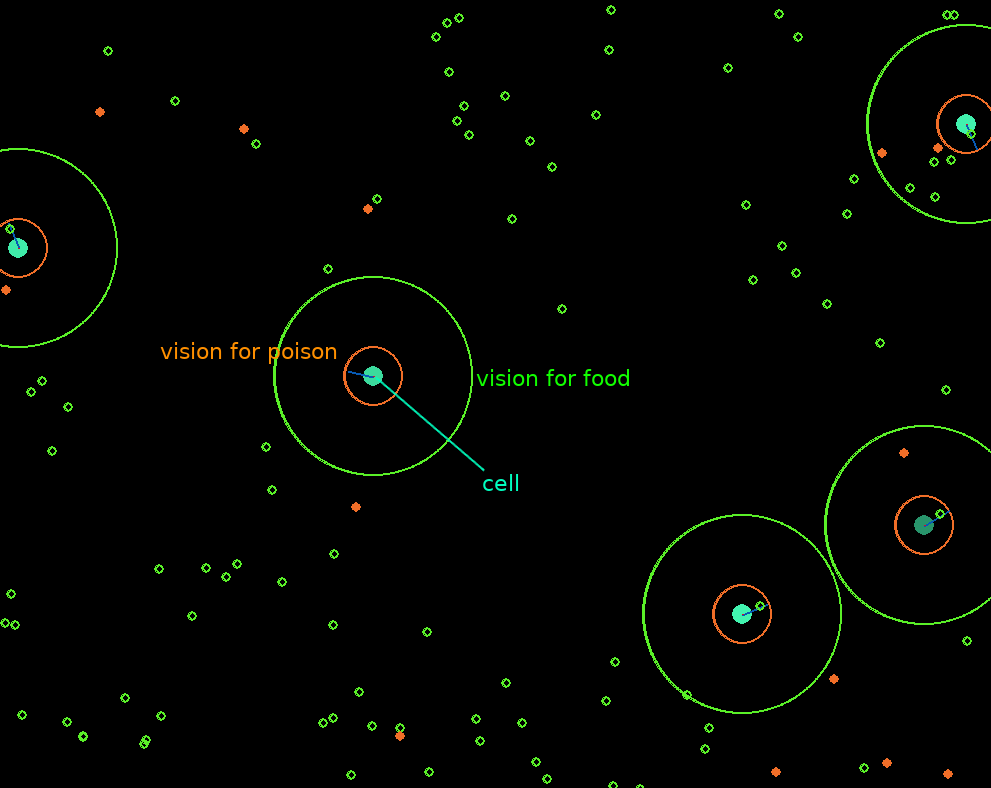

# Genetic algorithms simulation  

Installation
------------
Dependencies:  
pip3 install requirements.txt  
Run:  
python3 sim.py  

Description
------------
This is a simulation of a genetic algorithm  
The population is represented as a group of cells  
The cell's dna has the following properties:  
	-Radius (the size of the cell)  
	-vision for food (distance from which a cell can detect food)  
	-vision for poison (distance from which a cell can detect poison)  
	-desire for food (attraction towards food (litterally))  
	-desire for poison (attraction towards poison)  
	-move noise (distraction on the movement of the cell)  
	-age (for recording purposes)  
Screenshot
------------

The algorithm will converge to a solution that will be the most fit to stay alive:  
Eats enough food and avoids poison as possible.  
The attribute 'age' is used to detect how long a generation lasts.  
If a generation lives for too long, it is considered a solution.  
When a cell lives longer than 10000 generations, it is considered as a candidate solution, and it is printed to the console  
(You can redirect that to a file, and feed the value when starting the algorithm again fresh, which probably will yield better solutions)  
Note:  
------------
The idea is not original. But the implementation is mine.
